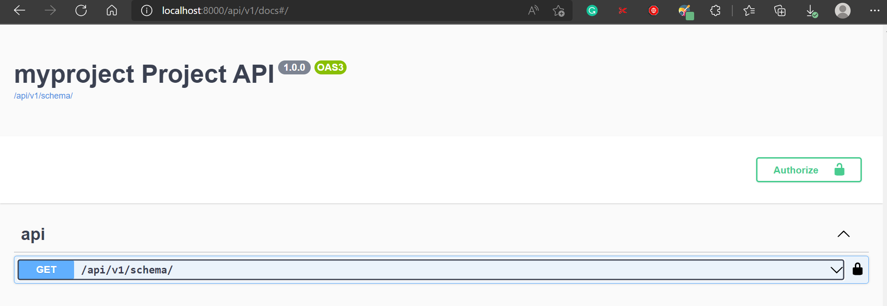

<h1 align="center">
  Django Rest CLI ✨
</h1>

<p align="center">
  
</p>

<p align="center">
   Scaffold your DRF project with common python packages configured, auto-generated docs, auto-generated CRUD endpoints, code linting with pre-commit hook, and more⚡🚀
</p>

<p align="center">
  <a href="https://github.com/pre-commit/pre-commit">
    
  </a>

  <a href="https://github.com/py-universe/django-rest-cli/actions?query=workflow%lint_and_test" target="_blank">
      
  </a>
  
  <a href="https://badge.fury.io/py/dr-cli" target="_blank">
    
  </a>
</p>


## What is Django Rest CLI ?
A CLI tool for _rapid_ Rest APIs development. It abstracts the repeated aspects of building a REST API with the Django Framework by:

- Allowing you start your project from one of three templates. Each template comes with features you'd most likely be setting up yourself already configured for you.

- Allowing you define your models and have this tool generate CRUD endpoints for each model defined.
For example, if you define a model, **Product** in your `models.py` file, this tool could generate a _GET /products POST /products PUT /products/<product_id>_ etc. endpoints for that model.

- Allowing you create all the apps in your project at once, if you know them before hand.


## Demo
working on it

## Usage: How to Work with this Tool

### Installation
```pip install dr-cli```

I highly recommend that you install this in a virtual environment.

### Create a New Project
- Run ```dr-cli startproject project_name``` to start a new DRF project.

- You'd be prompted to start your project from one of three templates: **Baisc, Medior, and Advanced** templates. Learn more about what each template comes bundled with [here](https://github.com/py-universe/django-rest-cli/blob/docs/templatesInfo.md).

- On selecting one of the templates your project will then be created. Git will be initialized in your project, and all project dependencies installed as shown in the image below:


The generated project comes with a nice Readme containing the steps for running the project


### Create New Apps in your Project
- Run ```dr-cli startapps todo me-nu user``` to create multiple Django apps in your project. Where `todo me-nu user` are your app names.

- Running the above command will create all your apps. Name validations would also be performed as shown in the image below:


**Note** Make sure to add your created apps to the list of INSTALLED APPS


### Generate CRUD Endpoints for your Apps
- Run ```dr-cli addcrud memo user``` to create CRUD endpoints for the models defined in the specified apps. 

- Running the above command would return a nice looking feedback as shown in the image below:


**Note** Make sure to register the `URLs` for each app in the top level `urls.py` file.

On Windows, Emojis are only supported in [Windows Terminal Preview](https://www.microsoft.com/en-us/p/windows-terminal-preview/9n8g5rfz9xk3?activetab=pivot:overviewtab)

### Accessing the docs page
- Run `python manage.py runserver` to fire up your local development server, and point your browser to `http://localhost:8000/api/v1/docs` to view the auto-generated docs page shown in the image below:




## Motivation
In creating REST APIs with the Django framework, I noticed there were things I kept repeating for every project. And there were things I just wished there was a better way of doing them. I created this CLI tool to address _the three concerns_ that mattered to me the most. Hopefully, it resonates with you too.

- **PROBLEM-1:**  I noticed I was repeating at least one of the following integrations, and features in every project:
  - A custom user model defined in a `users` app
  - Authentication endpoints.
  - [python-decouple](https://pypi.org/project/python-decouple/): for managing environment varibales 
  - [drf-spactacular](https://drf-spectacular.readthedocs.io/en/latest/readme.html): for auto-generating API docs 
  - [dj-database-url](https://github.com/jazzband/dj-database-url): for connecting to various databases 
  - [pre-commit, black, isort, flake8](https://ljvmiranda921.github.io/notebook/2018/06/21/precommits-using-black-and-flake8/): for code linting with pre-commit hooks 
  - [pytest-django](https://pytest-django.readthedocs.io/en/latest/): for writing unit tests with pytest 
  - [Docker](https://learndjango.com/tutorials/django-docker-and-postgresql-tutorial): for containerization. 

  So I wished there was a tool that could start my project with the integrations, and features I need configured. I found [cookie-cutter-django-rest](https://github.com/agconti/cookiecutter-django-rest) to be useful, but sometimes it's just too heavy for my use-case. I needed something more flexible, something that could start my project with few integrations or all the features and integrations above. 

  - **SOLUTION:** This CLI tool allows you start your project from one of three templates we provide: **Basic, Medior, and Advanced** templates. Depending on what template you select, you could scaffold your project with just python_decouple for managing env vars. Or you could go with something as complex as adding pytest for unit tests, drf_spectacular for auto-generating docs, authentication endpoints, pre-commit hook for code linting setup in your project, and docker support. Regardless of the template you select, we initialize git, install all project dependencies if internet connection is detected, and add a readme to your project.


- **PROBLEM-2:** I noticed most times I needed CRUD endpoints for the models I define. CRUD endpoints are so unchanging that I wish there was a tool that could just generate all the CRUD endpoints for the models I define.

  - **SOLUTION:** You can define your models and have this tool generate CRUD endpoints for each model defined. For example, if you define a model, **Product** in your `models.py` file, this tool could generate a _GET /products POST /products PUT /products/<product_id>_ etc. endpoints for that model.


- **PROBLEM-3:** I had always wish there was a way to create multiples apps at once in my Django project
  - **SOLUTION:** This tool allows you create multiple apps at once in this project.


## Contributing Guide
Coming soon... 


## Acknowledgements
In building this I re-used a few parts of these repositories in this project:
- [django-classy-start](https://github.com/mfonism/django-classy-start)
- [dr-scaffold](https://github.com/Abdenasser/dr_scaffold)


## I Love this, how can I thank you Nyior?
Please let your developer friends know about this repo :) If you star this repo too I won't complain xD


## Licence
MIT